# Informações do Projeto
`TÍTULO DO PROJETO`  

FinanKids

`CURSO` 

Engenharia de Software

## Participantes

Pedro Henrique Moreira Caixeta Ferreira

Hugo Viana Tinoco

Petrius Arturo Paglioni

Gustavo Menezes Barbosa

Enzo de Paiva Rezende

# Estrutura do Documento

- [Informações do Projeto](#informações-do-projeto)
  - [Participantes](#participantes)
- [Estrutura do Documento](#estrutura-do-documento)
- [Introdução](#introdução)
  - [Problema](#problema)
  - [Objetivos](#objetivos)
  - [Justificativa](#justificativa)
  - [Público-Alvo](#público-alvo)
- [Especificações do Projeto](#especificações-do-projeto)
  - [Personas e Mapas de Empatia](#personas-e-mapas-de-empatia)
  - [Histórias de Usuários](#histórias-de-usuários)
  - [Requisitos](#requisitos)
    - [Requisitos Funcionais](#requisitos-funcionais)
    - [Requisitos não Funcionais](#requisitos-não-funcionais)
  - [Restrições](#restrições)
- [Projeto de Interface](#projeto-de-interface)
  - [User Flow](#user-flow)
  - [Wireframes](#wireframes)
- [Metodologia](#metodologia)
  - [Divisão de Papéis](#divisão-de-papéis)
  - [Ferramentas](#ferramentas)
  - [Controle de Versão](#controle-de-versão)
- [**############## SPRINT 1 ACABA AQUI #############**](#-sprint-1-acaba-aqui-)
- [Projeto da Solução](#projeto-da-solução)
  - [Tecnologias Utilizadas](#tecnologias-utilizadas)
  - [Arquitetura da solução](#arquitetura-da-solução)
- [Avaliação da Aplicação](#avaliação-da-aplicação)
  - [Plano de Testes](#plano-de-testes)
  - [Ferramentas de Testes (Opcional)](#ferramentas-de-testes-opcional)
  - [Registros de Testes](#registros-de-testes)
- [Referências](#referências)

# Introdução

## Problema

O problema principal que pretendemos resolver é o de descontrole financeiro, falta de planejamento ou simplesmente saber lidar com o dinheiro de maneira geral. Uma criança, um adolescente descontrolado financeiramente, se torna adulto descontrolado, cheio de dívidas, sem sucesso e prosperidade. Visto que o endividamento dos brasileiros atingiu em março a máxima histórica para o mês, de 77,5%, a maior proporção já registrada nos 12 anos do levantamento. Segundo a Pesquisa de Endividamento e Inadimplência do Consumidor.

> Nesse momento você deve apresentar o problema que a sua aplicação deve
> resolver. No entanto, não é a hora de comentar sobre a aplicação.
> Descreva também o contexto em que essa aplicação será usada, se
> houver: empresa, tecnologias, etc. Novamente, descreva apenas o que de
> fato existir, pois ainda não é a hora de apresentar requisitos
> detalhados ou projetos.
>
> Nesse momento, o grupo pode optar por fazer uso
> de ferramentas como Design Thinking, que permite um olhar de ponta a
> ponta para o problema.
>
> **Links Úteis**:
> - [Objetivos, Problema de pesquisa e Justificativa](https://medium.com/@versioparole/objetivos-problema-de-pesquisa-e-justificativa-c98c8233b9c3)
> - [Matriz Certezas, Suposições e Dúvidas](https://medium.com/educa%C3%A7%C3%A3o-fora-da-caixa/matriz-certezas-suposi%C3%A7%C3%B5es-e-d%C3%BAvidas-fa2263633655)
> - [Brainstorming](https://www.euax.com.br/2018/09/brainstorming/)

## Objetivos

O que queremos com nosso projeto é mudar o mundo, mas devemos começar pequeno. Focando em crianças e adolescentes, que são o futuro de tudo. Através do nosso projeto iremos auxiliar pais, familiares e a escola a educar a criança financeiramente. Os pais poderão juntamente com a criança ter um controle do quanto de “mesada” a criança terá, dos gastos que ela vai ter. Dessa forma a criança crescerá sabendo dos seus limites, sabendo onde gastar seu dinheiro e como guardar e investir.

> Aqui você deve descrever os objetivos do trabalho indicando que o
> objetivo geral é desenvolver um software para solucionar o problema
> apresentado acima. Apresente também alguns (pelo menos 2) objetivos
> específicos dependendo de onde você vai querer concentrar a sua
> prática investigativa, ou como você vai aprofundar no seu trabalho.
> 
> **Links Úteis**:
> - [Objetivo geral e objetivo específico: como fazer e quais verbos utilizar](https://blog.mettzer.com/diferenca-entre-objetivo-geral-e-objetivo-especifico/)

## Justificativa

O motivo desta escolha foi por conta da necessidade das crianças de hoje em hoje em obter uma educação financeira logo cedo assim, ajudando cada vez mais na construção do futuro das mesmas. Foi aprofundado na questão de entrada e saída de dinheiro, colocando também o acesso ao mercado de ações e aulas de como investir de forma correta o dinheiro.

> Descreva a importância ou a motivação para trabalhar com esta aplicação
> que você escolheu. Indique as razões pelas quais você escolheu seus
> objetivos específicos ou as razões para aprofundar em certos aspectos
> do software.
> 
> O grupo de trabalho pode fazer uso de questionários, entrevistas e
> dados estatísticos, que podem ser apresentados, com o objetivo de
> esclarecer detalhes do problema que será abordado pelo grupo.
>
> **Links Úteis**:
> - [Como montar a justificativa](https://guiadamonografia.com.br/como-montar-justificativa-do-tcc/)

## Público-Alvo

Educadores para ajudar nas aulas e transparecer as mentes das crianças e dos jovens, pais na hora de educar e realizar investimentos, crianças , adolescentes e jovens são os protagonistas, eles irão construir seus futuros com esses ensinamentos.

> Descreva quem serão as pessoas que usarão a sua aplicação indicando os
> diferentes perfis. O objetivo aqui não é definir quem serão os
> clientes ou quais serão os papéis dos usuários na aplicação. A ideia
> é, dentro do possível, conhecer um pouco mais sobre o perfil dos
> usuários: conhecimentos prévios, relação com a tecnologia, relações
> hierárquicas, etc.
>
> Adicione informações sobre o público-alvo por meio de uma descrição
> textual, ou diagramas de personas, mapa de stakeholders, ou como o
> grupo achar mais conveniente.
> 
> **Links Úteis**:
> - [Público-alvo: o que é, tipos, como definir seu público e exemplos](https://klickpages.com.br/blog/publico-alvo-o-que-e/)
> - [Qual a diferença entre público-alvo e persona?](https://rockcontent.com/blog/diferenca-publico-alvo-e-persona/)
 
# Especificações do Projeto

No projeto terá um formato com tela de login onde após logar. Terá uma tela mostrando as receitas, as despesas e o saldo. Terá uma função para adicionar uma transação assim podendo adicionar uma categoria, o valor, o tipo (Receita ou despesa) e a data do lançamento. O usuário também poderá excluir quando quiser e ter acesso a todo histórico de transação e o gráfico. Para completar uma tela de notícias de como investir melhor seu dinheiro.

> Apresente uma visão geral do que será abordado nesta parte do
> documento, enumerando as técnicas e/ou ferramentas utilizadas para
> realizar a especificações do projeto

## Personas

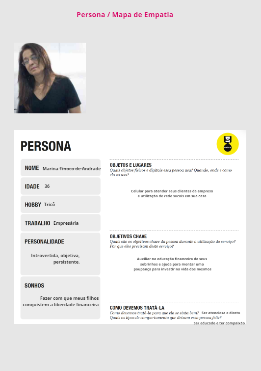

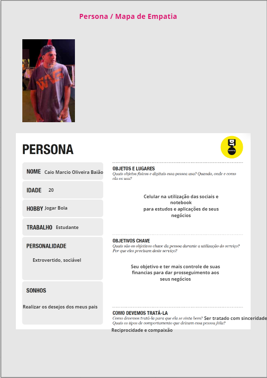

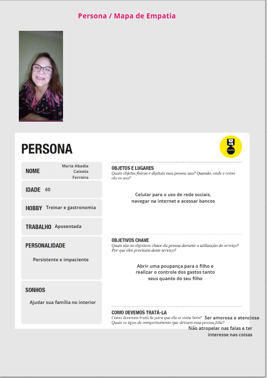

> Relacione as personas identificadas no seu projeto e os respectivos mapas de empatia. Lembre-se que 
> você deve ser enumerar e descrever precisamente e de forma
> personalizada todos os principais envolvidos com a solução almeja. 
> 
> Para tanto, baseie-se tanto nos documentos disponibilizados na disciplina
> e/ou nos seguintes links:
>
> **Links Úteis**:
> - [Persona x Público-alvo](https://flammo.com.br/blog/persona-e-publico-alvo-qual-a-diferenca/)
> - [O que é persona?](https://resultadosdigitais.com.br/blog/persona-o-que-e/)
> - [Rock Content](https://rockcontent.com/blog/personas/)
> - [Hotmart](https://blog.hotmart.com/pt-br/como-criar-persona-negocio/)
> - [Mapa de Empatia](https://resultadosdigitais.com.br/blog/mapa-da-empatia/)
> - [Como fazer um mapa de empatia - Vídeo](https://www.youtube.com/watch?v=JlKHGpVoA2Y)
> 
> 
> **Exemplo de Persona**
> 
> 
> 
> Fonte: [Como criar uma persona para o seu negócio](https://raissaviegas.com.br/como-criar-uma-persona/)

## Histórias de Usuários

Com base na análise das personas forma identificadas as seguintes histórias de usuários:

|EU COMO... `PERSONA`| QUERO/PRECISO ... `FUNCIONALIDADE` |PARA ... `MOTIVO/VALOR`                 |
|--------------------|------------------------------------|----------------------------------------|
|Usuário do sistema  | Realizar o registro no sistema     | Salvar todos os dados no sistema       |
|Usuário do sistema  | Realizar o login no sistema        | Entrar no sistema                      |
|Usuário do sistema  | Registrar minhas transações        | Controlar transações (Entrada e saida) |
|Usuário do sistema  | Visualizar Informações de perfil   | Visualizar meus dados                  |
|Usuário do sistema  | Visualizar graficos, lista de transações | Ter controle dos gastos          |
|Usuário do sistema  | Mercado de ações                   | Visualizar o mercado de acoes          |
|Administrador       | Alterar permissões                 | Permitir que possam administrar contas |

> Apresente aqui as histórias de usuário que são relevantes para o
> projeto de sua solução. As Histórias de Usuário consistem em uma
> ferramenta poderosa para a compreensão e elicitação dos requisitos
> funcionais e não funcionais da sua aplicação. Se possível, agrupe as
> histórias de usuário por contexto, para facilitar consultas
> recorrentes à essa parte do documento.
>
> **Links Úteis**:
> - [Histórias de usuários com exemplos e template](https://www.atlassian.com/br/agile/project-management/user-stories)
> - [Como escrever boas histórias de usuário (User Stories)](https://medium.com/vertice/como-escrever-boas-users-stories-hist%C3%B3rias-de-usu%C3%A1rios-b29c75043fac)

## Requisitos

As tabelas que se seguem apresentam os requisitos funcionais e não funcionais que detalham o escopo do projeto.

### Requisitos Funcionais - Atualizados após as sprints

|ID    | Descrição do Requisito  | Prioridade |
|------|-----------------------------------------|----|
|RF-001| Permirtir que o usuario se cadastre no sistema | ALTA | 
|RF-002| Permirtir que o usuario logue no sistema | ALTA |
|RF-003| Permitir que um usuario realize transações |ALTA |
|RF-004| Visualizar lista de transações           | MÉDIA |
|RF-005| Visualizar as receitas, as despesas e o saldo | MÉDIA |
|RF-006| Visualizar grafico de transações           | MÉDIA |
|RF-008| Permitir trocar o tema da pagina (Escuro ou claro) | BAIXA |
|RF-007| Permitir que o usuario vizualize as Informações de perfil | MÉDIA | 
|RF-008| Permitir visualizar ações | MÉDIA |
|RF-009| Permitir que o usuário realize logout | ALTA |

### Requisitos não Funcionais

|ID     | Descrição do Requisito  |Prioridade |
|-------|-------------------------|----|
|RNF-001| O sistema deve ser responsivo para rodar em um dispositivos móvel | MÉDIA | 
|RNF-002| Deve processar requisições do usuário em no máximo 7s |  BAIXA |
|RNF-003| Deve ser facil de entender |  ALTA |
|RNF-004| Facil usabilidade e acessibilidade |  ALTA |

> Com base nas Histórias de Usuário, enumere os requisitos da sua
> solução. Classifique esses requisitos em dois grupos:
>
> - [Requisitos Funcionais (RF)](https://pt.wikipedia.org/wiki/Requisito_funcional):
>   correspondem a uma funcionalidade que deve estar presente na
>   plataforma (ex: cadastro de usuário).
>
> - [Requisitos Não Funcionais (RNF)](https://pt.wikipedia.org/wiki/Requisito_n%C3%A3o_funcional):
>   correspondem a uma característica técnica, seja de usabilidade,
>   desempenho, confiabilidade, segurança ou outro (ex: suporte a
>   dispositivos iOS e Android).
>
> Lembre-se que cada requisito deve corresponder à uma e somente uma
> característica alvo da sua solução. Além disso, certifique-se de que
> todos os aspectos capturados nas Histórias de Usuário foram cobertos.
> 
> **Links Úteis**:
> 
> - [O que são Requisitos Funcionais e Requisitos Não Funcionais?](https://codificar.com.br/requisitos-funcionais-nao-funcionais/)
> - [O que são requisitos funcionais e requisitos não funcionais?](https://analisederequisitos.com.br/requisitos-funcionais-e-requisitos-nao-funcionais-o-que-sao/)

## Restrições

O projeto está restrito pelos itens apresentados na tabela a seguir.

|ID| Restrição                                             |
|--|-------------------------------------------------------|
|01| O projeto deverá ser entregue até o final do semestre |
|02| Não pode ser desenvolvido um módulo de backend        |
|03| Devera ser desensolvido em HTML, CSS, JS em front end |
|04| Devera ter base de dados                              |

> Enumere as restrições à sua solução. Lembre-se de que as restrições
> geralmente limitam a solução candidata.
> 
> **Links Úteis**:
> - [O que são Requisitos Funcionais e Requisitos Não Funcionais?](https://codificar.com.br/requisitos-funcionais-nao-funcionais/)
> - [O que são requisitos funcionais e requisitos não funcionais?](https://analisederequisitos.com.br/requisitos-funcionais-e-requisitos-nao-funcionais-o-que-sao/)

# Projeto de Interface

Tela de cadastro

Tela de Login

Tela de Perfil

Tela de Menu com gráficos e lista de transações

Aba de transações com todas as sprints unificadas

Tela de ações

> Apresente as principais interfaces da solução. Discuta como 
> foram elaboradas de forma a atender os requisitos funcionais, não
> funcionais e histórias de usuário abordados nas [Especificações do
> Projeto](#especificações-do-projeto).

## User Flow

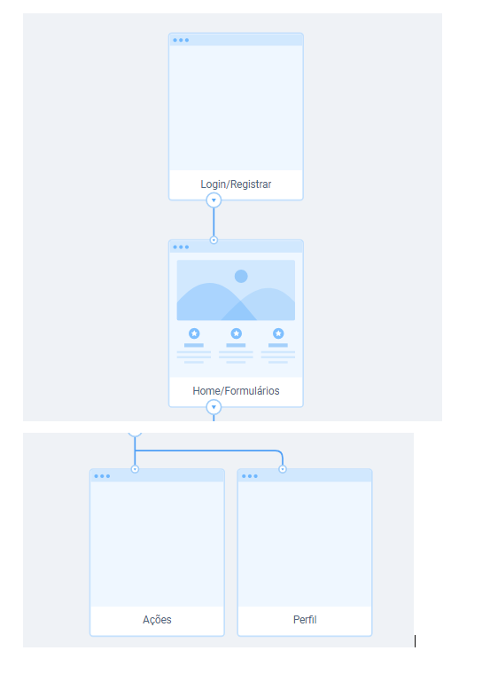

> Fluxo de usuário (User Flow) é uma técnica que permite ao desenvolvedor
> mapear todo fluxo de telas do site ou app. Essa técnica funciona
> para alinhar os caminhos e as possíveis ações que o usuário pode
> fazer junto com os membros de sua equipe.
>
> **Links Úteis**:
> - [User Flow: O Quê É e Como Fazer?](https://medium.com/7bits/fluxo-de-usu%C3%A1rio-user-flow-o-que-%C3%A9-como-fazer-79d965872534)
> - [User Flow vs Site Maps](http://designr.com.br/sitemap-e-user-flow-quais-as-diferencas-e-quando-usar-cada-um/)
> - [Top 25 User Flow Tools & Templates for Smooth](https://www.mockplus.com/blog/post/user-flow-tools)
>
> **Exemplo**:
> 
> 

## Wireframes

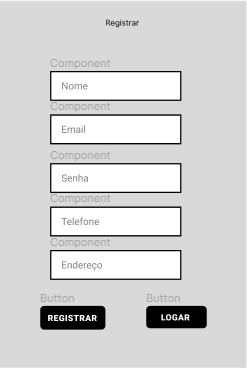

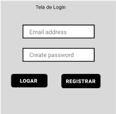

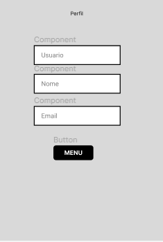

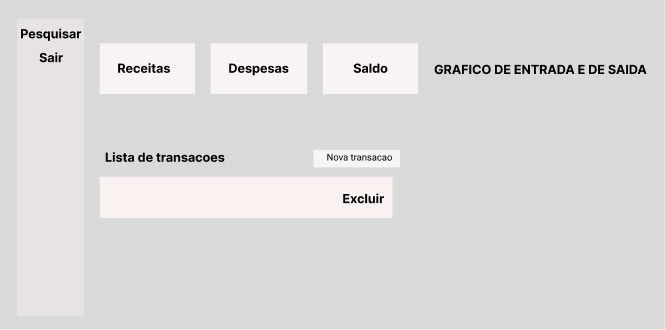

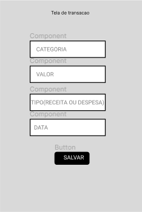

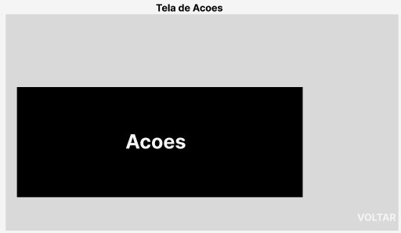

> Wireframes são protótipos das telas da aplicação usados em design de interface para sugerir a
> estrutura de um site web e seu relacionamentos entre suas
> páginas. Um wireframe web é uma ilustração semelhante ao
> layout de elementos fundamentais na interface.
> 
> **Links Úteis**:
> - [Ferramentas de Wireframes](https://rockcontent.com/blog/wireframes/)
> - [Figma](https://www.figma.com/)
> - [Adobe XD](https://www.adobe.com/br/products/xd.html#scroll)
> - [MarvelApp](https://marvelapp.com/developers/documentation/tutorials/)
> 
> **Exemplo**:
> 
> 

# Metodologia

Pedro Henrique Moreira Caixeta Ferreira - Cuidou da parte de documentação do github, wireframes, miro, parte de organização, tela de perfil e todo o resto

Hugo Viana Tinoco - Cuidou dos Slides, judou na parte do design thinking, parte de organização

Petrius Arturo Paglioni - Cuidou da parte de documentação, tela de ações

Gustavo Menezes Barbosa - Opiniões no trabalho, parte do local storage

Enzo de Paiva Rezende - Opiniões no trabalho, , parte do local storage

> Nesta parte do documento, você deve apresentar a metodologia 
> adotada pelo grupo, descrevendo o processo de trabalho baseado nas metodologias ágeis, 
> a divisão de papéis e tarefas, as ferramentas empregadas e como foi realizada a
> gestão de configuração do projeto via GitHub.
>
> Coloque detalhes sobre o processo de Design Thinking e a implementação do Framework Scrum seguido
> pelo grupo. O grupo poderá fazer uso de ferramentas on-line para acompanhar
> o andamento do projeto, a execução das tarefas e o status de desenvolvimento
> da solução.
> 
> **Links Úteis**:
> - [Tutorial Trello](https://trello.com/b/8AygzjUA/tutorial-trello)
> - [Gestão ágil de projetos com o Trello](https://www.youtube.com/watch?v=1o9BOMAKBRE)
> - [Gerência de projetos - Trello com Scrum](https://www.youtube.com/watch?v=DHLA8X_ujwo)
> - [Tutorial Slack](https://slack.com/intl/en-br/)

## Divisão de Papéis

Scrum Master: Pedro Henrique Moreira Caixeta Ferreira

Product Owner: Hugo Viana Tinoco

Equipe de Desenvolvimento

Petrius Arturo Paglioni (Desenvolvedor Front End)

Gustavo Menezes Barbosa (Desenvolvedor Back End)

Hugo Viana Tinoco (Analista de Negócios)

Enzo de Paiva Rezende (Designer)

> Apresente a divisão de papéis e tarefas entre os membros do grupo.
>
> **Links Úteis**:
> - [11 Passos Essenciais para Implantar Scrum no seu Projeto](https://mindmaster.com.br/scrum-11-passos/)
> - [Scrum em 9 minutos](https://www.youtube.com/watch?v=XfvQWnRgxG0)

## Ferramentas

| Ambiente  | Plataforma              |Link de Acesso |
|-----------|-------------------------|---------------|
|Processo de Design Thinkgin  | Miro |  [https://miro.com/XXXXXXX](https://miro.com/app/board/uXjVPTfmQrc=/) | 
|Repositório de código | GitHub | [https://github.com/XXXXXXX](https://github.com/ICEI-PUC-Minas-PPLES-TI/plf-es-2022-2-ti1-7924100-educacao-financeira-para-criancas-2)|
|Protótipo Interativo | Figma | [https://figma.com/XXXXXXX](https://www.figma.com/file/TR3Ub8AM5iDMJ9dmB91vb7/Educa%C3%A7%C3%A3o-Financeira-Atualizados?node-id=0%3A1&t=BznliJPvoQ2ZBQ2p-1) | 

>
> Liste as ferramentas empregadas no desenvolvimento do
> projeto, justificando a escolha delas, sempre que possível.
> 
> As ferramentas empregadas no projeto são:
> 
> - Editor de código.
> - Ferramentas de comunicação
> - Ferramentas de diagramação
> - Plataforma de hospedagem
> 
> O editor de código foi escolhido porque ele possui uma integração com o
> sistema de versão. As ferramentas de comunicação utilizadas possuem
> integração semelhante e por isso foram selecionadas. Por fim, para criar
> diagramas utilizamos essa ferramenta por melhor captar as
> necessidades da nossa solução.
> 
> **Links Úteis - Hospedagem**:
> - [Getting Started with Heroku](https://devcenter.heroku.com/start)
> - [Crie seu Site com o HostGator](https://www.hostgator.com.br/como-publicar-seu-site)
> - [GoDady](https://br.godaddy.com/how-to)
> - [GitHub Pages](https://pages.github.com/)

## Controle de Versão

Versao Final

> Discuta como a configuração do projeto foi feita na ferramenta de
> versionamento escolhida. Exponha como a gerência de tags, merges,
> commits e branchs é realizada. Discuta como a gerência de issues foi
> realizada.
> A ferramenta de controle de versão adotada no projeto foi o
> [Git](https://git-scm.com/), sendo que o [Github](https://github.com)
> foi utilizado para hospedagem do repositório `upstream`.
> 
> O projeto segue a seguinte convenção para o nome de branchs:
> 
> - `master`: versão estável já testada do software
> - `unstable`: versão já testada do software, porém instável
> - `testing`: versão em testes do software
> - `dev`: versão de desenvolvimento do software
> 
> Quanto à gerência de issues, o projeto adota a seguinte convenção para
> etiquetas:
> 
> - `bugfix`: uma funcionalidade encontra-se com problemas
> - `enhancement`: uma funcionalidade precisa ser melhorada
> - `feature`: uma nova funcionalidade precisa ser introduzida
>
> **Links Úteis**:
> - [Tutorial GitHub](https://guides.github.com/activities/hello-world/)
> - [Git e Github](https://www.youtube.com/playlist?list=PLHz_AreHm4dm7ZULPAmadvNhH6vk9oNZA)
> - [5 Git Workflows & Branching Strategy to deliver better code](https://zepel.io/blog/5-git-workflows-to-improve-development/)
>
> **Exemplo - GitHub Feature Branch Workflow**:
>
> 

# Projeto da Solução

Criar um sistema acessível para (crianças, jovens, adultos e educadores) possibilitando inserir transações de receitas e despesas, a categoria e data de lançamento, podendo realizar o controle do dinheiro mensal e complementando com uma aba de notícias sobre economia.

## Tecnologias Utilizadas

HTML
CSS
JAVASCRIPT
JQUERY
JSON
API Ações - ALPHAVANTAGE
VSCODE
GO LIVE
HOST - AWARDSPACE

> Descreva aqui qual(is) tecnologias você vai usar para resolver o seu
> problema, ou seja, implementar a sua solução. Liste todas as
> tecnologias envolvidas, linguagens a serem utilizadas, serviços web,
> frameworks, bibliotecas, IDEs de desenvolvimento, e ferramentas.
> Apresente também uma figura explicando como as tecnologias estão
> relacionadas ou como uma interação do usuário com o sistema vai ser
> conduzida, por onde ela passa até retornar uma resposta ao usuário.
> 
> Inclua os diagramas de User Flow, esboços criados pelo grupo
> (stoyboards), além dos protótipos de telas (wireframes). Descreva cada
> item textualmente comentando e complementando o que está apresentado
> nas imagens.

## Arquitetura da solução

 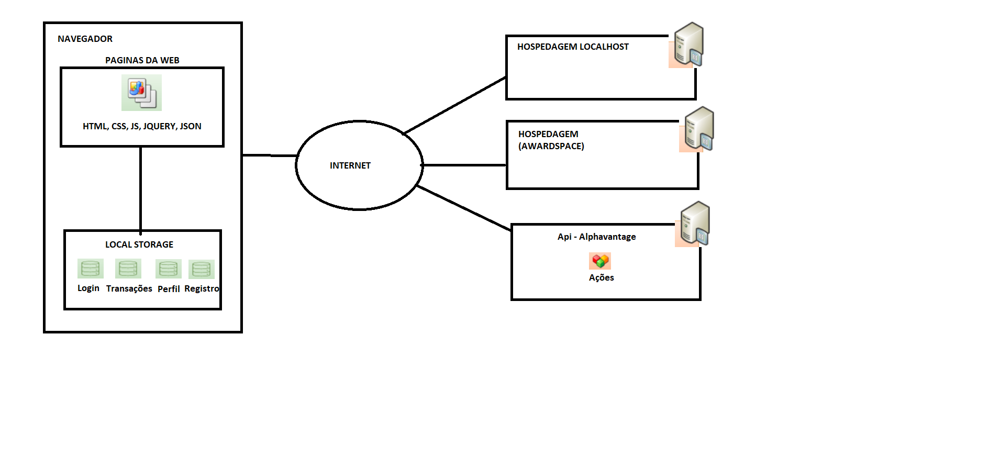

> Inclua um diagrama da solução e descreva os módulos e as tecnologias
> que fazem parte da solução. Discorra sobre o diagrama.
> 
> **Exemplo do diagrama de Arquitetura**:
> 
> 

# Avaliação da Aplicação

O usuário entra no sistema, cria sua conta, ao acessar o site, ele adiciona algumas transações, o sistema existe o total de receitas, despesas e seu saldo juntamente com o gráfico. O usuário acessa a aba de pesquisas e tira algumas informações, depois finaliza de utilizar o software e realiza logout.

> Apresente os cenários de testes utilizados na realização dos testes da
> sua aplicação. Escolha cenários de testes que demonstrem os requisitos
> sendo satisfeitos.

## Plano de Testes

1 – Teste da página de cadastro e login com autenticação no sistema.

2 – Teste do formulário de transação.

3 – Teste de excluir a transação.

4 – Teste da exibição da receita, despesa juntamente com a exibição do saldo.

5 – Teste do gráfico de despesas e receitas

6 – Teste de logout no sistema

> Enumere quais cenários de testes foram selecionados para teste. Neste
> tópico o grupo deve detalhar quais funcionalidades avaliadas, o grupo
> de usuários que foi escolhido para participar do teste e as
> ferramentas utilizadas.
> 
> **Links Úteis**:
> - [IBM - Criação e Geração de Planos de Teste](https://www.ibm.com/developerworks/br/local/rational/criacao_geracao_planos_testes_software/index.html)
> - [Práticas e Técnicas de Testes Ágeis](http://assiste.serpro.gov.br/serproagil/Apresenta/slides.pdf)
> -  [Teste de Software: Conceitos e tipos de testes](https://blog.onedaytesting.com.br/teste-de-software/)

## Registros de Testes

Foram realizados alguns testes, testes de autenticação, testes de criação da tela de transações, da implementação de receitas, despesas e saldos, teste de registros, também implantação de gráficos e tela de ações.

Pontos fortes: Criança da tela de autenticação, exibição de perfil e implementação e junção das sprints para uma tela só, chamada de formulário de transações.

Pontos Fracos: Implementar uma tela de ações com api gratuita, devido a sua disponibilidade.

O aplicativo teve muitas melhorias, mas as principais falhas foram durante a criação do local storage, onde houve problemas de criação de funções e declaração de todas as variáveis utilizadas no processo.

Contudo, o aplicativo foi testado e todos os erros corrigidos.

> Discorra sobre os resultados do teste. Ressaltando pontos fortes e
> fracos identificados na solução. Comente como o grupo pretende atacar
> esses pontos nas próximas iterações. Apresente as falhas detectadas e
> as melhorias geradas a partir dos resultados obtidos nos testes.

# Referências

Sites: 

[W3schol](https://www.w3schools.com/)

[Api - Alphavantage](https://www.alphavantage.co/)

[Stackoverflow](https://stackoverflow.com/)

> Inclua todas as referências (livros, artigos, sites, etc) utilizados
> no desenvolvimento do trabalho.
> 
> **Links Úteis**:
> - [Formato ABNT](https://www.normastecnicas.com/abnt/trabalhos-academicos/referencias/)
> - [Referências Bibliográficas da ABNT](https://comunidade.rockcontent.com/referencia-bibliografica-abnt/)
